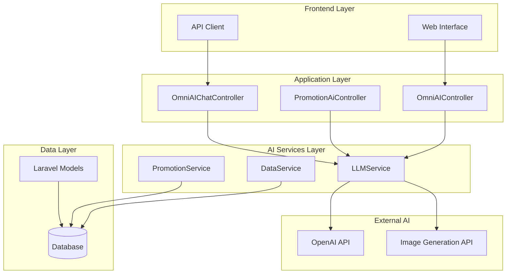
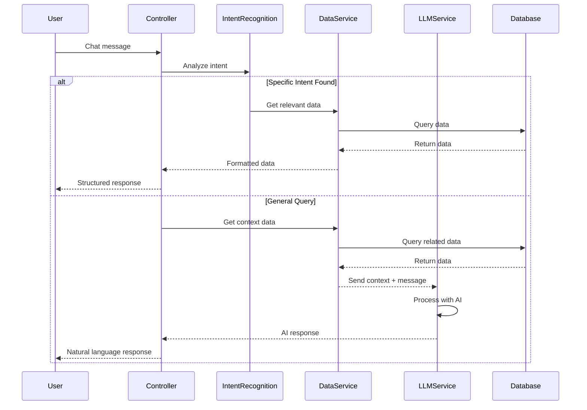
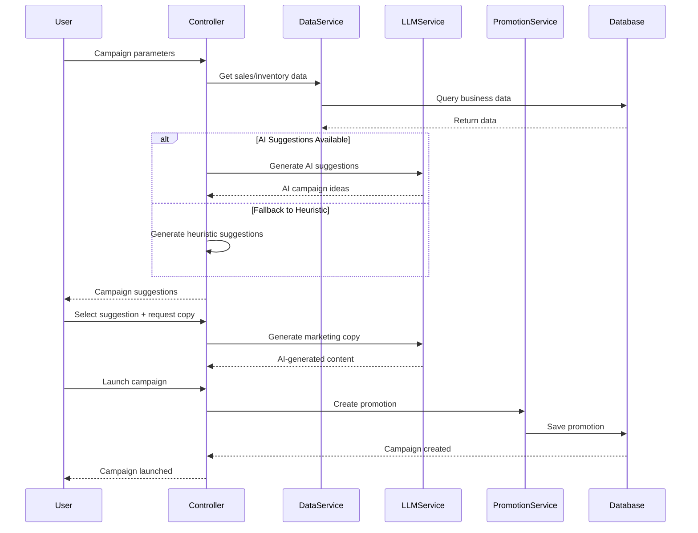

# 📊 BÁO CÁO THIẾT KẾ KIẾN TRÚC CHI TIẾT HỆ THỐNG AI AGENTS
## Dự án PerfumeShop - Hệ thống Quản lý Cửa hàng Nước hoa

---

## 📋 MỤC LỤC

1. [Tổng quan Hệ thống](#1-tổng-quan-hệ-thống)
2. [Kiến trúc Tổng thể](#2-kiến-trúc-tổng-thể)
3. [Các AI Agents Chính](#3-các-ai-agents-chính)
4. [Thành phần Kỹ thuật](#4-thành-phần-kỹ-thuật)
5. [Luồng Xử lý Dữ liệu](#5-luồng-xử-lý-dữ-liệu)
6. [Tích hợp và API](#6-tích-hợp-và-api)
7. [Bảo mật và Hiệu suất](#7-bảo-mật-và-hiệu-suất)
8. [Triển khai và Mở rộng](#8-triển-khai-và-mở-rộng)

---

## 1. TỔNG QUAN HỆ THỐNG

### 1.1 Mục tiêu Hệ thống AI Agents

Hệ thống AI Agents trong PerfumeShop được thiết kế để:

- **Tự động hóa quyết định kinh doanh** thông qua phân tích dữ liệu thông minh
- **Hỗ trợ quản trị viên** trong việc đưa ra quyết định dựa trên insights từ AI
- **Tối ưu hóa vận hành** cửa hàng nước hoa thông qua các gợi ý thông minh
- **Cung cấp trải nghiệm tương tác** tự nhiên với hệ thống thông qua ngôn ngữ tự nhiên

### 1.2 Phạm vi Ứng dụng

- **Quản lý Sản phẩm**: Gợi ý sản phẩm, phân tích tồn kho, dự đoán nhu cầu
- **Quản lý Khuyến mãi**: Tự động tạo chiến dịch khuyến mãi thông minh
- **Phân tích Kinh doanh**: Báo cáo xu hướng, KPI, insights
- **Hỗ trợ Khách hàng**: Trợ lý tra cứu thông tin, tư vấn sản phẩm
- **Tự động hóa**: Workflow thông minh, cảnh báo bất thường

---

## 2. KIẾN TRÚC TỔNG THỂ

### 2.1 Mô hình Kiến trúc



### 2.2 Nguyên tắc Thiết kế

- **Modular Architecture**: Tách biệt các thành phần AI thành modules độc lập
- **Service-Oriented**: Sử dụng pattern Service để tách biệt logic nghiệp vụ
- **Data-Driven**: Tất cả quyết định AI đều dựa trên dữ liệu thực tế
- **Fail-Safe**: Có cơ chế fallback khi AI không hoạt động
- **Scalable**: Dễ dàng mở rộng thêm AI agents mới

---

## 3. CÁC AI AGENTS CHÍNH

### 3.1 OmniAI - Trợ lý Tổng quát

**Mục đích**: Trợ lý AI đa chức năng cho quản trị viên

**Tính năng chính**:
- Tra cứu đơn hàng theo mã số
- Tra cứu khách hàng theo SĐT
- Kiểm tra tồn kho thấp
- Xem chương trình khuyến mãi đang chạy
- Mô phỏng khuyến mãi
- Báo cáo KPI và phân tích kinh doanh
- Chat thông minh về sản phẩm nước hoa

**Kiến trúc**:
```php
class OmniAIChatController {
    // Intent Recognition
    - looksLikeOrderLookup()
    - looksLikeCustomerLookup()
    - looksLikeLowStock()
    - looksLikeActivePromotions()
    - looksLikeKpi()
    
    // Data Processing
    - handleOrderLookup()
    - handleCustomerLookup()
    - handleLowStock()
    - handleActivePromotions()
    - handleKpi()
    
    // LLM Integration
    - searchProducts()
    - formatProductsForLLM()
    - extractProductKeywords()
}
```

### 3.2 PromotionAI - Agent Khuyến mãi Thông minh

**Mục đích**: Tự động tạo và quản lý chiến dịch khuyến mãi

**Tính năng chính**:
- Phân tích dữ liệu bán hàng và tồn kho
- Gợi ý chiến dịch khuyến mãi dựa trên mục tiêu
- Sinh nội dung marketing bằng AI
- Tạo hình ảnh quảng cáo
- Khởi chạy chiến dịch với kiểm soát rủi ro
- Gửi email marketing

**Kiến trúc**:
```php
class PromotionAiController {
    // Campaign Generation
    - suggest() // AI + Heuristic suggestions
    - generateCopy() // AI content generation
    - generateImage() // AI image generation
    
    // Campaign Management
    - launch() // Create promotion from suggestion
    - sendEmail() // Email marketing
    
    // Data Analysis
    - analyzeSalesData()
    - calculateKPIs()
    - predictRevenue()
}
```

### 3.3 DataService - Agent Phân tích Dữ liệu

**Mục đích**: Cung cấp dữ liệu thực tế cho các AI agents

**Tính năng chính**:
- Thu thập dữ liệu từ database
- Chuẩn hóa dữ liệu cho LLM
- Phân tích xu hướng bán hàng
- Tính toán metrics kinh doanh
- Cung cấp context cho AI

**Kiến trúc**:
```php
class DataService {
    // Data Collection
    - getRealDataForLLM()
    - getSalesData()
    - getInventoryData()
    - getCustomerData()
    
    // Data Processing
    - formatDataForAI()
    - calculateMetrics()
    - extractTrends()
}
```

---

## 4. THÀNH PHẦN KỸ THUẬT

### 4.1 LLMService - Core AI Engine

**Cấu hình**:
- **Model**: GPT-4o-mini (OpenAI)
- **Temperature**: 0.3 (cân bằng sáng tạo và chính xác)
- **Max Tokens**: 500
- **Timeout**: 30 giây

**Tính năng**:
```php
class LLMService {
    // Core Methods
    - chat($message, $context) // Main chat interface
    - generateImage($prompt) // Image generation
    - isConfigured() // Configuration check
    
    // Context Management
    - addProductContext()
    - addRealDataContext()
    - addConversationHistory()
    
    // System Prompts
    - getDefaultSystemPrompt() // OmniAI personality
    - getPromotionPrompt() // Marketing specialist
}
```

**System Prompt Strategy**:
- **OmniAI**: Trợ lý nội bộ chuyên nghiệp, chỉ dựa trên dữ liệu thực tế
- **PromotionAI**: Chuyên gia marketing, tạo nội dung sáng tạo
- **Context-aware**: Tự động thêm dữ liệu liên quan vào context

### 4.2 Intent Recognition System

**Pattern Matching**:
```php
// Order Lookup
preg_match('/(đơn|order)\s*(số|number)?\s*#?([A-Za-z0-9\-]+)/ui', $message)

// Customer Lookup  
preg_match('/(sđt|sdt|phone|điện\s*thoại)\s*(:|là)?\s*(\+?\d[\d\s\-]{6,})/ui', $message)

// Low Stock
preg_match('/(tồn\s*thấp|low\s*stock|hết\s*hàng)/ui', $message)

// KPI Reports
preg_match('/(kpi|tổng\s*quan|chỉ\s*số)\s*(hôm\s*nay|tuần|tháng|quý|năm)?/ui', $message)
```

**Fallback Strategy**:
1. Pattern matching cho các intent cụ thể
2. LLM chat cho các câu hỏi phức tạp
3. Smalltalk response cho các trường hợp không xác định

### 4.3 Data Integration Layer

**Real-time Data Access**:
```php
// Product Data
Product::with(['variants', 'categories'])->get()

// Sales Data  
Order::sales()->where('created_at', '>=', $since)->get()

// Inventory Data
ProductVariant::select(['product_id', DB::raw('SUM(stock) as stock')])

// Customer Data
Customer::where('phone', $phone)->first()
```

**Data Formatting for AI**:
- UTF-8 encoding cho tiếng Việt
- Structured data cho LLM context
- Error handling cho data access failures

---

## 5. LUỒNG XỬ LÝ DỮ LIỆU

### 5.1 OmniAI Chat Flow



### 5.2 PromotionAI Campaign Flow



### 5.3 Data Processing Pipeline

**Input Processing**:
1. **Message Analysis**: Phân tích câu hỏi để xác định intent
2. **Context Gathering**: Thu thập dữ liệu liên quan
3. **Data Validation**: Kiểm tra tính hợp lệ của dữ liệu
4. **Format Preparation**: Chuẩn bị dữ liệu cho AI

**AI Processing**:
1. **Context Injection**: Thêm dữ liệu thực tế vào system prompt
2. **LLM Call**: Gọi OpenAI API với context đầy đủ
3. **Response Processing**: Xử lý và validate response từ AI
4. **Error Handling**: Xử lý lỗi và fallback

**Output Processing**:
1. **Response Formatting**: Định dạng response cho frontend
2. **Data Enrichment**: Thêm metadata và analytics
3. **Logging**: Ghi log cho monitoring và debugging

---

## 6. TÍCH HỢP VÀ API

### 6.1 API Endpoints

**OmniAI Chat API**:
```php
POST /api/ai/chat
{
    "message": "tìm nước hoa nam phù hợp cho mùa hè",
    "context": {
        "cart": [...],
        "customer_id": 123
    }
}

Response:
{
    "success": true,
    "type": "llm|order_lookup|customer_lookup|low_stock|promotions_active|kpi|report_*",
    "reply": "AI response hoặc structured data"
}
```

**PromotionAI API**:
```php
POST /api/promotions/ai/suggest
{
    "objective": "push_stock|increase_aov|reactivation|seasonal",
    "max_discount_percent": 20,
    "min_order_amount": 500000,
    "window_days": 30
}

Response:
{
    "success": true,
    "suggestions": [
        {
            "campaign_id": "uuid",
            "objective": "push_stock",
            "name_suggestion": "Xả tồn hàng chậm xoay",
            "type": "percent",
            "discount_value": 25,
            "predicted_uplift_revenue": 15000000,
            "analysis_data": {...}
        }
    ]
}
```

### 6.2 Frontend Integration

**Chat Interface**:
- Real-time chat với WebSocket support
- Message history và context preservation
- Typing indicators và loading states
- Error handling và retry mechanisms

**Promotion Dashboard**:
- Interactive campaign builder
- Real-time preview của AI suggestions
- Drag-and-drop interface cho campaign setup
- Analytics dashboard cho campaign performance

### 6.3 External Integrations

**OpenAI Integration**:
- RESTful API calls với proper authentication
- Rate limiting và quota management
- Error handling cho API failures
- Model selection và parameter tuning

**Email Marketing**:
- SMTP integration cho campaign emails
- Template system cho AI-generated content
- Customer segmentation và targeting
- Delivery tracking và analytics

---

## 7. BẢO MẬT VÀ HIỆU SUẤT

### 7.1 Bảo mật

**API Security**:
- Authentication middleware cho tất cả AI endpoints
- Rate limiting để tránh abuse
- Input validation và sanitization
- SQL injection protection

**Data Privacy**:
- Không lưu trữ conversation history lâu dài
- Anonymization của customer data trong AI context
- GDPR compliance cho data processing
- Secure API key management

**AI Safety**:
- Content filtering cho AI-generated content
- Validation của AI responses trước khi hiển thị
- Fallback mechanisms khi AI fails
- Human oversight cho critical decisions

### 7.2 Hiệu suất

**Caching Strategy**:
- Redis cache cho frequently accessed data
- LLM response caching cho similar queries
- Database query optimization
- Static asset caching

**Performance Monitoring**:
- Response time tracking cho AI calls
- Error rate monitoring
- Resource usage tracking
- User experience metrics

**Scalability**:
- Horizontal scaling của AI services
- Database connection pooling
- Async processing cho heavy operations
- Load balancing cho high traffic

### 7.3 Error Handling

**Graceful Degradation**:
```php
try {
    $aiResponse = $llmService->chat($message, $context);
} catch (Exception $e) {
    Log::error('LLM Error', ['error' => $e->getMessage()]);
    return $this->fallbackResponse($message);
}
```

**Fallback Strategies**:
1. **LLM Unavailable**: Sử dụng rule-based responses
2. **Data Access Failed**: Cached data hoặc default responses  
3. **API Rate Limited**: Queue requests và retry later
4. **Network Issues**: Offline mode với cached responses

---

## 8. TRIỂN KHAI VÀ MỞ RỘNG

### 8.1 Deployment Architecture

**Development Environment**:
- Local development với SQLite
- Docker containers cho consistency
- Environment-specific configurations
- Automated testing pipeline

**Production Environment**:
- Laravel Forge/Vapor deployment
- MySQL database với replication
- Redis cho caching và sessions
- CDN cho static assets

**Monitoring và Logging**:
- Laravel Telescope cho debugging
- Custom logging cho AI operations
- Performance monitoring với New Relic
- Error tracking với Sentry

### 8.2 Mở rộng Tương lai

**Additional AI Agents**:
- **InventoryAI**: Dự đoán nhu cầu tồn kho
- **CustomerAI**: Phân tích hành vi khách hàng
- **PriceAI**: Tối ưu hóa giá sản phẩm
- **RecommendationAI**: Gợi ý sản phẩm cá nhân hóa

**Advanced Features**:
- **Multi-language Support**: Hỗ trợ tiếng Anh và các ngôn ngữ khác
- **Voice Interface**: Tích hợp speech-to-text
- **Computer Vision**: Phân tích hình ảnh sản phẩm
- **Predictive Analytics**: Machine learning models

**Integration Opportunities**:
- **E-commerce Platforms**: Shopify, WooCommerce
- **Social Media**: Facebook, Instagram marketing
- **CRM Systems**: Salesforce, HubSpot
- **Analytics Tools**: Google Analytics, Mixpanel

### 8.3 Best Practices

**Code Organization**:
- Service classes cho business logic
- Repository pattern cho data access
- Factory pattern cho AI model creation
- Observer pattern cho event handling

**Testing Strategy**:
- Unit tests cho individual services
- Integration tests cho API endpoints
- Mock external AI services trong tests
- Performance tests cho AI operations

**Documentation**:
- API documentation với OpenAPI/Swagger
- Code comments và docblocks
- User guides cho AI features
- Architecture decision records (ADRs)

---

## 📊 KẾT LUẬN

Hệ thống AI Agents trong PerfumeShop được thiết kế với kiến trúc modular, scalable và maintainable. Với các AI agents chính như OmniAI và PromotionAI, hệ thống cung cấp:

- **Tự động hóa thông minh** cho các quyết định kinh doanh
- **Trải nghiệm người dùng** tự nhiên và trực quan
- **Tích hợp seamless** với hệ thống hiện có
- **Khả năng mở rộng** cho các tính năng AI tương lai

Kiến trúc này đảm bảo tính ổn định, bảo mật và hiệu suất cao, đồng thời cho phép dễ dàng mở rộng và phát triển thêm các AI agents mới trong tương lai.

---

**Tài liệu được tạo bởi**: AI Assistant  
**Ngày tạo**: $(date)  
**Phiên bản**: 1.0  
**Dự án**: PerfumeShop - Hệ thống Quản lý Cửa hàng Nước hoa

